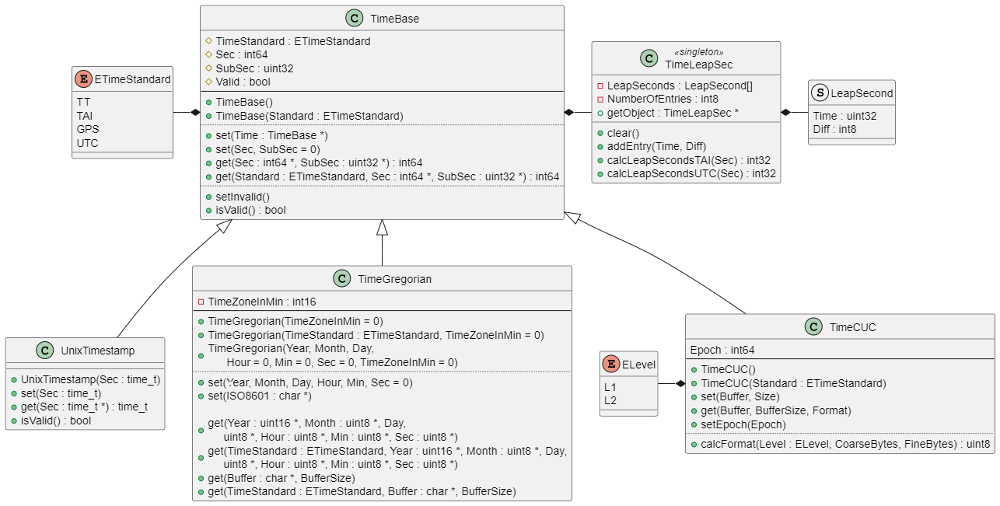

# TimeConvert

Time library to convert different time formats 

## General

This time library supports the usually used ISO 8601 time format, the UNIX timestamp format and the CUC format as used in Aerospace.

It additionally supports leap seconds and different time bases: TT, TAI, GPS and UTC. 

## Features

Supported date and time formats:
* Gregorian (ISO 8601, human-readable)
* UNIX timestamp (seconds since 1970)
* CUC as used in Aerospace according to CCSDS 301.0-B-2

Supported time bases:
* TT: Terrestrial Time, based on SI second
* TAI: Temps Atomique International, messured by atomic clocks; TAI = TT + ~32.184s  
* GPS: GPS-Time; UCT = TAI - 19s
* UTC: Universal Time Coordinated; UTC = TAI - leap seconds  

Implementation:
* Implemented as C++ class with common Arduino style guide
* Low memory consumption overhead

## Integration

Here the integration of the TimeConvert library is shown with a simple Arduino Sketch:

* include the library

  ```C++
  #include <timeconvert.h>
  ```

* create an of the time format you want to use:

  ```C++
  TimeGregorian myTimeGreg;
  UnixTimestamp myUnixTimeStamp;
  TimeCuc myCucTime;
  ```

## Usage

TODO


## API

### Setup

TODO


### Operation

TODO


## Diagrams

### Class Diagram

This diagram illustrates the classes of the library and their connections. 




## Limitations
                                               
TODO


## Known Anomalies

* none


## Changelog

### 1.0.0

* Initial release


## Website

Further information can be found on [GitHub](https://github.com/steftri/timeconvert).


